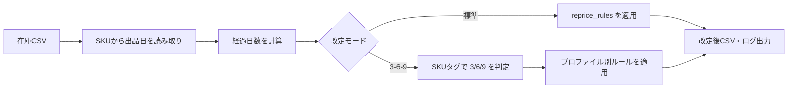

# HIRIO 価格改定ルール 解説

在庫CSVをアップロードすると、**出品からの経過日数**に応じて価格・Trace・akaji（赤字価格）などを自動計算する仕組みの説明です。

設定ファイル: `config/reprice_rules.json`  
計算ロジック: `python/services/repricer_weekly.py`

---

## 1. 全体の流れ



1. 在庫CSVの各行（SKU）について、SKU文字列から**仕入・出品日**を推定する  
2. 今日との差分で**経過日数**を出す  
3. 経過日数に合う**ルール帯**（30日刻み）を選ぶ  
4. ルールのアクションに従い、新しい価格・Trace・akaji を計算する  
5. 結果をプレビュー表示し、問題なければCSVとして出力する  

---

## 2. 改定モードは2種類

| モード | 用途 | 設定の場所 |
|--------|------|------------|
| **標準（standard）** | 従来の週次改定。シンプルなアクション中心 | `reprice_rules` |
| **3-6-9（369）** | SKUに付けた 3/6/9 タグで戦略を切り替える本番運用向け | `rule_profiles` / `exception_reprice_rules` |

現在の既定値（2026-06-10 時点）:

- デフォルトプロファイル: **6**
- 3-6-9プリセット: **回転重視（turnover）**
- 改定間隔: **7日**（段階的値下げの1ステップ幅の目安）

---

## 3. 経過日数の決め方

SKUの先頭付近に日付が埋め込まれている前提です。

**読み取り例:**

| SKUの例 | 読み取る日付 |
|---------|--------------|
| `20250201-B0007RBX52-UM-1650-1` | 2025年2月1日 |
| `2024_08_28-...` | 2024年8月28日 |
| `250518-...` | 2025年5月18日（YYMMDD） |

**特殊な扱い:**

| 状況 | 動作 |
|------|------|
| 日付が読み取れない | **維持**（価格変更なし） |
| 365日を超える | **除外**（手動対応が必要） |
| 価格改定OFF（仕入DB） | **除外** |
| 除外SKUリストに登録 | **除外** |

---

## 4. 30日刻みのルール帯

ルールは **30日ごと** に区切られます。

| 帯 | 経過日数の範囲 | 3-6-9でのTP帯 |
|----|----------------|---------------|
| 1帯目 | 1〜30日 | TP0 |
| 2帯目 | 31〜60日 | TP0 |
| 3帯目 | 61〜90日 | TP0 |
| 4帯目 | 91〜120日 | TP1 |
| 5帯目 | 121〜150日 | TP1 |
| 6帯目 | 151〜180日 | TP1 |
| 7帯目 | 181〜210日 | TP2 |
| 8帯目 | 211〜240日 | TP2 |
| 9帯目 | 241〜270日 | TP2 |
| 10帯目 | 271〜300日 | TP3 |
| 11帯目 | 301〜330日 | TP3 |
| 12帯目 | 331〜360日 | TP3 |
| 最終帯 | 361日以上 | ルールにより維持 or 継続改定 |

「120日経過」の商品には、**120日以下で最も近い帯**（ここでは91〜120日帯）のルールが適用されます。

---

## 5. アクション一覧（やることの種類）

| アクション名 | 画面表示 | 価格 | Trace | 補足 |
|--------------|----------|------|-------|------|
| `maintain` | 維持 | 変更なし | 変更なし | |
| `priceTrace` | Trace変更 | 変更なし※ | 変更あり | ※3-6-9ではTP段階調整あり |
| `price_down_1` | 1%値下げ | 現在価格 × 0.99 | 変更なし | 利益ガードあり |
| `price_down_2` | 2%値下げ | 現在価格 × 0.98 | 変更なし | 利益ガードあり |
| `price_down_ignore` | 1%値下げ(利益無視) | 現在価格 × 0.99 | 変更なし | akajiを空にしてストッパー回避 |
| `tp_down` | TP値下げ | Keepa最安を参考に段階的下げ | 変更なし | 3-6-9専用 |
| `instant_reprice` | 即時改定 | 目標価格へ一気に変更 | 0（維持） | 月別ラダー専用 |
| `exclude` | 除外 | 変更なし | 変更なし | 出力から除外 |

### Trace（priceTrace）の値

| 値 | 意味 |
|----|------|
| 0 | 維持 |
| 1 | FBA状態合わせ |
| 2 | 状態合わせ |
| 3 | FBA最安値 |
| 4 | 最安値 |
| 5 | カート価格 |

---

## 6. 標準モード（reprice_rules）

PWAや従来タブ向けのシンプルなルールです。  
現在の設定（`config/reprice_rules.json`）:

| 経過日数（〜日） | アクション | Trace値 |
|------------------|------------|---------|
| 30 | Trace変更 | 1（FBA状態合わせ） |
| 60 | Trace変更 | 1 |
| 90 | Trace変更 | 1 |
| 120 | 1%値下げ | 4 |
| 150 | 1%値下げ | 3 |
| 180 | 1%値下げ | 4 |
| 210 | 2%値下げ | 5 |
| 240 | 2%値下げ | 3 |
| 270 | 2%値下げ | 0 |
| 300 | 1%値下げ(利益無視) | 1 |
| 330 | 1%値下げ(利益無視) | 3 |
| 360 | 1%値下げ(利益無視) | 4 |
| 999 | 2%値下げ | 4 |

**利益ガード（標準モード）:**

- `profit_guard_percentage`（現在 **1.1**）未満には価格を下げない  
- 値下げ後にこの下限を割る場合、下限価格で止める  

---

## 7. 3-6-9モードの考え方

### 7.1 プロファイル（3 / 6 / 9）の選び方

SKU文字列からタグを検出します。

| 検出パターン例 | 適用ルール |
|----------------|------------|
| `-3-` / `3P` / `3N` | **3ルール**（早めに利益確保） |
| `-6-` / `6P` / `6N` | **6ルール**（バランス） |
| `-9-` / `9P` / `9N` | **9ルール**（長期・特殊商品） |
| タグなし + 仕入DBにTP入力あり | **6ルール**にフォールバック |
| タグなし + TP未入力 | **例外ルール**を適用 |

### 7.2 TP（Target Price）とは

仕入時に設定する **目標価格の下限** です（TP0〜TP3）。

| 帯 | 期間 | 役割（イメージ） |
|----|------|------------------|
| TP0 | 〜90日 | 初動〜3ヶ月：高めを維持 |
| TP1 | 91〜180日 | 4〜6ヶ月：やや譲る |
| TP2 | 181〜270日 | 7〜9ヶ月：さらに譲る |
| TP3 | 271日〜 | 最終段階：売り切り寄り |

**TP下限の決め方（優先順）:**

1. 仕入DB（`hirio.db`）に登録された TP0〜TP3 の金額  
2. 未設定時は `tp_rates`（利益保持率%）から算出  
   - 計算式: `max(akaji, 現在価格) × (保持率 / 100)` を四捨五入  

### 7.3 現在のプリセット「回転重視」の TP保持率

3ルール・6ルール共通（9ルールは別設定）:

| TP | 保持率 |
|----|--------|
| TP0 | 90% |
| TP1 | 65% |
| TP2 | 50% |
| TP3 | 5% |

9ルールは全期間 **95%** 固定（特殊商品向け・価格はほぼ維持しTrace中心）。

### 7.4 TP0の3つの概念（重要）

| 概念 | 設定場所 | 意味 |
|------|----------|------|
| **TP0価格** | 仕入DB / TP自動(369) | この帯で参照する金額（下限の目安） |
| **TP0（追従）** | ルール表のTP列 | 〜90日帯で出品価格からTP0へ段階的に下げる |
| **TP0（価格維持）** | ルール表のTP列 | 〜90日帯は出品価格を維持（Trace・akajiのみ更新） |
| **TP0下限固定** | 共通チェックボックス | TP0未満にしない（下回っていれば復帰） |

**プリセット既定（2026-06 改定後）:**

| プリセット | TP0帯（ルール表） | TP0追従（共通） | TP0下限固定 |
|------------|-------------------|-----------------|-------------|
| 回転重視 | 全行 **TP0（追従）** | ON | OFF |
| 利益重視 | 全行 **TP0（価格維持）** | OFF | ON |
| バランス | 1〜60日 維持 / 61〜90日 追従 | OFF | OFF |

### 7.5 3-6-9での価格計算（priceTrace / tp_down）

**基本方針:** 毎回の改定実行時に「ざっくり引き直し」。厳密な等間隔は不要。

```
残り日数 = 帯の終了日 - 現在の経過日数
ステップ数 = ceil(残り日数 / interval_days)   ※ interval_days=7
1回あたりの下げ幅 = (開始価格 - TP下限) / ステップ数
新価格 = max(TP下限, 開始価格 - 下げ幅)
```

**tp_down の場合（Keepa連携）:**

- CSVの `keepa_min_same_condition`（同コンディション最安）を参照  
- `keepa_min < TP下限` → 価格はTP下限で固定し、理由欄に **ALERT** を表示  
- `keepa_min >= TP下限` → `min(現在価格, keepa_min)` から段階的に下げる  

**TP1以降:** 常に段階的にそのTP価格へ近づけます。

### 7.5 akaji（赤字価格）・takane（高値）

ルールごとに%が設定されています。

| 項目 | 意味 |
|------|------|
| `akaji_drop_percent` | 改定後価格から何%下げた値をakajiにするか（1〜10%） |
| `takane_rise_percent` | 改定後価格から何%上げた値をtakaneにするか（0〜10%） |

**ガードの考え方:**

- 価格を下げる途中でakaji/TP下限を割り込む場合 → 下限で止める  
- **すでに現在価格が下限以下** → 値上げしない（現状維持）  

### 7.6 6ルールの現在設定（抜粋）

| 経過日数（〜日） | アクション | TP目標 | akaji下げ% | takane上げ% |
|------------------|------------|--------|------------|-------------|
| 30〜90 | Trace変更 | TP0（追従）※回転重視 | 5% | 1% |
| 120〜180 | Trace変更 | TP1 | 7% | 1% |
| 210〜270 | Trace変更 | TP2 | 8% | 1% |
| 300〜360 | Trace変更 | TP3 | 10% | 1% |
| 999 | 維持 | TP3 | 10% | 1% |

3ルールは6ルールと同じ構成（TP保持率も同じプリセット値）。  
9ルールは全期間 Trace変更・TP0・akaji 1%・takane 1%。

### 7.7 例外ルール（exception_reprice_rules）

SKUに3/6/9タグがなく、仕入DBにもTPが無い商品向け。  
**標準モードに近い**値下げ中心のルールが適用されます（現在の設定は標準 `reprice_rules` とほぼ同等）。

---

## 8. 月別運用（個別ラダー）

仕入DBで SKU ごとに `ladder_enabled` と `ladder_rules` が有効な場合、  
3/6/9プロファイルより **個別ラダーが優先** されます。

- 各行に `target_price`（目標価格）を設定可能  
- `priceTrace` / `tp_down` / `instant_reprice` などを組み合わせ  
- 3-6-9と同様の段階的引き直しロジックを、SKU単位で上書き  

---

## 9. プリセット一覧（3-6-9設定画面）

| プリセットID | 表示名 | 特徴 |
|--------------|--------|------|
| `turnover` | 回転重視 | TP0=90%, TP1=65%, TP2=50%, TP3=5%。売れ残りを減らす |
| `balance` | バランス重視 | TP0=95%, TP1=75%, TP2=60%, TP3=10% |
| `profit` | 利益重視 | TP0=95%, …。TP0帯は価格維持＋下限固定 |
| `custom` | カスタム | 手動編集した内容をそのまま使用 |

プリセットを変更すると `rule_profiles` の 3/6/9 ルールと TP保持率が一括更新されます（9ルールの基本形は固定）。

---

## 10. その他の全体設定

| 設定キー | 現在値 | 説明 |
|----------|--------|------|
| `profit_guard_percentage` | 1.1 | 標準モードの最低価格（円） |
| `q4_rule_enabled` | false | Q4（年末商戦）向け特別ルール（無効） |
| `excluded_skus` | [] | 改定対象外SKUリスト |
| `interval_days` | 7 | 段階的下げの1ステップ間隔（日） |
| `alerts.enabled` | true | Keepa最安 < TP下限 時のアラート |
| `alerts.reason_prefix` | ALERT | 理由欄に付く接頭辞 |
| `default_profile` | 6 | SKUタグ不明時の既定プロファイル |
| `tp0_gradual_follow` | プリセット依存 | 旧 `tp0` 行の既定（追従するか） |
| `tp0_floor_guard` | プリセット依存 | TP0未満にしない（利益重視=ON） |

---

## 11. 出力される主な列（プレビュー・ログ）

| 列 | 内容 |
|----|------|
| `days` | 経過日数 |
| `price` / `new_price` | 改定前・改定後価格 |
| `priceTrace` / `new_priceTrace` | Traceの変更前後 |
| `action` | 実行されたアクション（日本語） |
| `reason` | 判断理由（TP適用・ALERT・フォールバック等） |
| `tp_floor` | 適用されたTP下限 |
| `akaji` / `takane` | 改定後の赤字価格・高値 |
| `csv_profit` | 在庫CSV由来の見込み利益 |

---

## 12. 関連ファイル早見表

| ファイル | 役割 |
|----------|------|
| `config/reprice_rules.json` | ルール設定の本体 |
| `python/services/repricer_weekly.py` | 改定計算のメインロジック |
| `python/desktop/services/repricer_369_presets.py` | 3-6-9プリセット定義 |
| `python/utils/repricer_ladder_core.py` | 30日帯・月別ラダー共通定義 |
| `python/routers/repricer.py` | FastAPI エンドポイント |
| `python/desktop/ui/repricer_widget.py` | デスクトップ改定画面 |
| `python/desktop/ui/repricer_settings_widget.py` | ルール設定画面 |

---

## 13. 運用のヒント

1. **SKUに日付と3/6/9タグを入れる**と、意図したルールが自動選択されます。  
2. **仕入DBにTPを入れておく**と、%計算より正確な下限価格が使われます。  
3. 理由欄に `ALERT` が出たSKUは、市場最安がTP下限を下回っているサインです。目視確認を推奨します。  
4. 365日超・日付不明・改定OFFの商品は自動改定されません。定期的に手動確認してください。  
5. ルール変更後は必ず**プレビュー**で数件確認してからCSV出力してください。

---

*最終更新: 2026-06-18（`config/reprice_rules.json` および `repricer_weekly.py` に基づく）*
